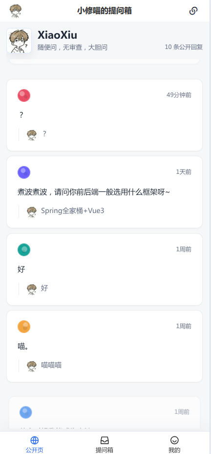
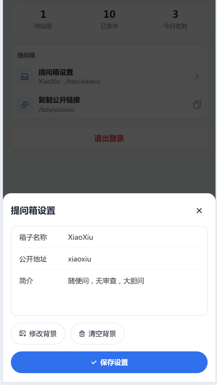

# AskBox

匿名提问箱项目，包含一个 Spring Boot 后端和一个 Vue 3 前端。用户可以通过公开链接匿名提问，提问箱主在个人页面处理待回答问题，管理员在后台管理用户、提问箱、问题、角色、附件和系统设置。




## 技术栈

- 后端：Java 21、Spring Boot 3、MyBatis-Plus、PostgreSQL、Redis、Flyway、Sa-Token、Knife4j、Hutool
- 前端：Vue 3、Vite、Pinia、Vue Router、Vant、LiquidGlass、vite-imagetools
- 基础设施：Docker Compose 提供 PostgreSQL 和 Redis

## 目录结构

```text
askbox/
  backend/              Spring Boot 后端
  ui/                   Vue 前端
  docs/                 项目文档
  data/                 本地 Docker 数据目录
  docker-compose.yml    PostgreSQL / Redis 本地依赖
  .env.example          本地环境变量示例
```

## 快速启动

### 1. 启动依赖服务

```bash
cp .env.example .env
docker compose up -d
```

默认 `.env.example` 使用：

```text
DB_HOST=localhost
DB_PORT=5432
DB_NAME=askbox
DB_USER=askbox
DB_PASSWORD=askbox
REDIS_HOST=localhost
REDIS_PORT=6379
REDIS_PASSWORD=
```

`REDIS_PASSWORD` 留空表示 Redis 无密码；填写非空值时，Docker Redis 会启用 `requirepass`，后端也会使用同一个密码连接。

如果修改了 `.env` 里的端口，需要保证后端运行时也能读取同样的环境变量。Spring Boot 当前读取的是运行目录下的 `.env` 或系统环境变量。

### 2. 启动后端

```bash
cd backend
./gradlew bootRun
```

后端默认端口：`http://localhost:8080`

接口文档：

- Knife4j：`http://localhost:8080/doc.html`
- OpenAPI JSON：`http://localhost:8080/v3/api-docs`

Flyway 会在启动时自动执行 `backend/src/main/resources/db/migration` 下的数据库迁移。

### 3. 启动前端

```bash
cd ui
npm install
npm run dev
```

前端默认端口：`http://localhost:5173`

Vite 已配置 `/api` 代理到 `http://localhost:8080`。

## 默认账号和页面

初始化管理员账号：

```text
email: admin@askbox.local
password: admin123
```

主要页面：

- 匿名提问页：`/box/:slug`，例如 `/box/admin`
- 个人页面：`/home`
- 管理员页面：`/admin`
- 登录页：`/login`
- 注册页：`/register`，需管理员在后台系统设置中开启注册并配置邮件。

角色：

- `ADMIN`：系统管理员，可以进入 `/admin`
- `BOX_OWNER`：提问箱主，可以进入 `/home`

附件库当前使用 base64 入库，后续可迁移到对象存储。

后端：

```bash
cd backend
./gradlew test
./gradlew bootRun
./gradlew spotlessApply
```

前端：

```bash
cd ui
npm run dev
npm run dev:classic
npm run build
npm run build:classic
npm run preview
```

前端公共侧支持两套编译期主题：

- `liquid`：默认主题，保留现有液态玻璃 UI。
- `classic`：非液态玻璃主题，使用 Vant 轻应用组件和更克制顺滑的动效。

构建产物分别输出到 `ui/dist/liquid` 和 `ui/dist/classic`。`npm run build` 默认等价于 `npm run build:liquid`，`npm run build:all` 可同时构建两套主题。

基础服务：

```bash
docker compose up -d
docker compose down
docker compose logs -f postgres
docker compose logs -f redis
```
